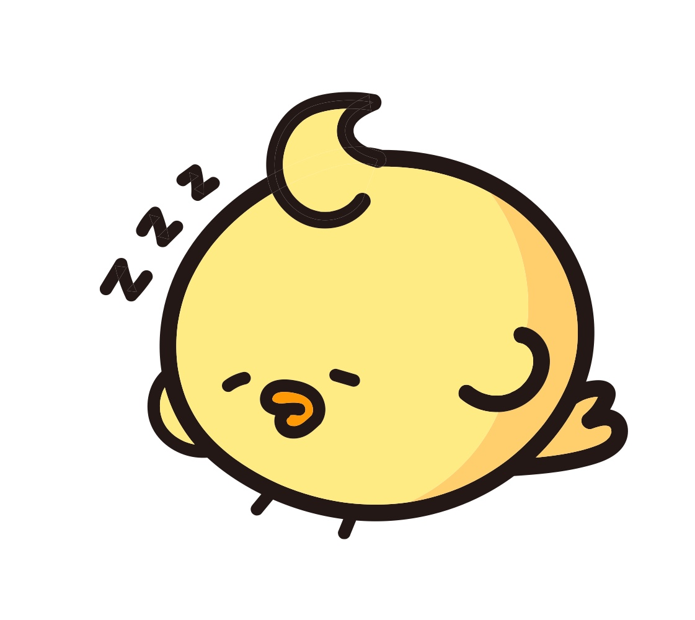
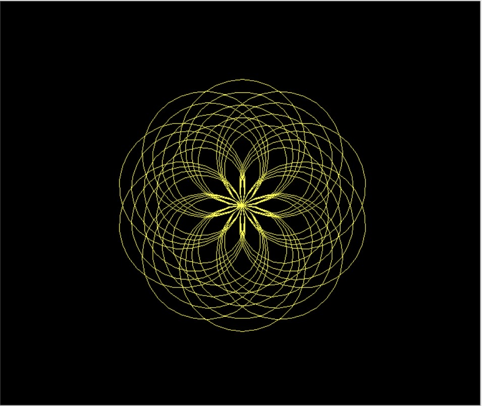
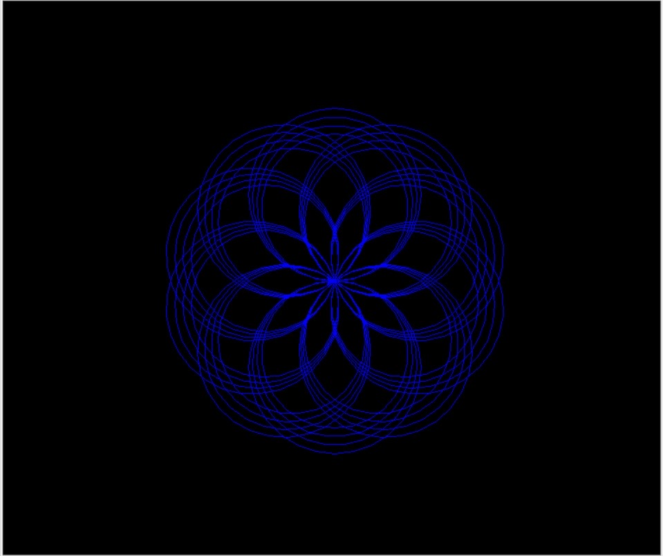
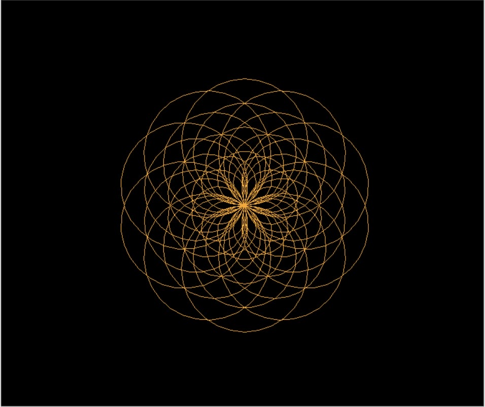
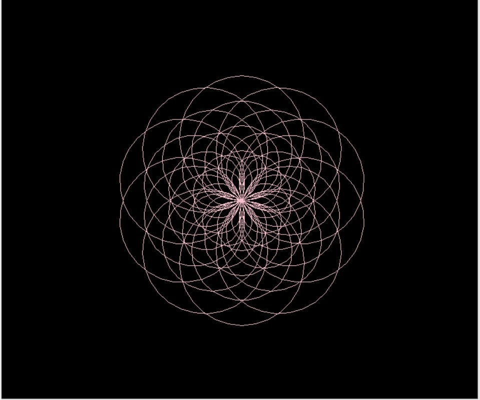
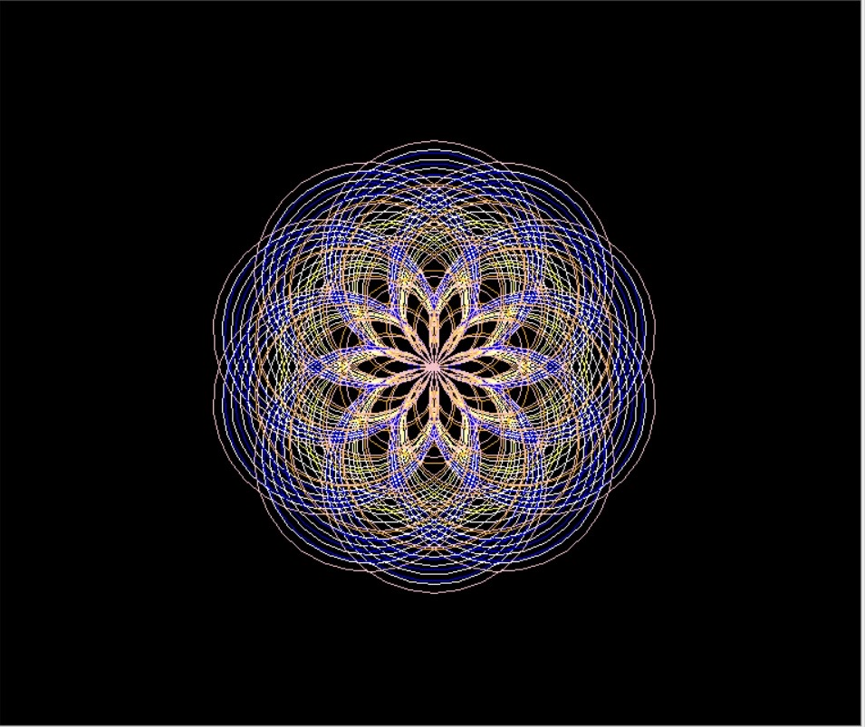
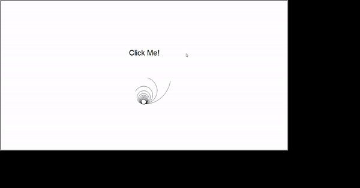
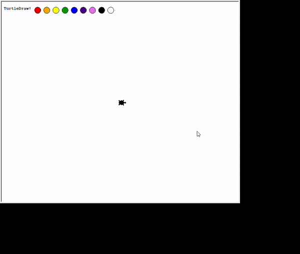

# 나만의 파이썬 프로젝트 제작 
+ `python` 라이브러리 및 프레임워크 사용(`turtle`, `pygame`, `tkinter`)
## 1. 기본적인 코드 모음
['turtle' 기본 코드](https://python.flowdas.com/library/turtle.html)

['pygame' 기본 코드](https://python101.readthedocs.io/pl/latest/_downloads/pygame192.pdf)

['tkinter' 기본 코드](https://www.tutorialspoint.com/python/python_gui_programming.htm)

## 2. 쓸만한 예제로 실습자료 만들기
  - 쓸만한 예제로 실습자료 만들자(turtle)
  
  [`turtle` 실습1](https://trinket.io/python/efc940a414)
  [`turtle` 실습2](https://trinket.io/python/88dd6c94d1)
  [`turtle` 실습3](https://trinket.io/python/64577872dd)
  - 쓸만한 예제로 실습자료 만들자(pygame)
  
  [`pygame` 실습1](http://programarcadegames.com/python_examples/f.php?file=snake.py)
  [`pygame` 실습2](http://programarcadegames.com/python_examples/show_file.php?file=move_sprite_keyboard_smooth.py)
  [`pygame` 실습3](http://programarcadegames.com/python_examples/show_file.php?file=bullets.py)
  - 쓸만한 예제로 실습자료 만들자(tkinter) 
  
  [`tkinter` 실습1](https://www.crocus.co.kr/1520)
  [`tkinter` 실습2](https://www.tutorialsteacher.com/python/create-ui-using-tkinter-in-python)
  [`tkinter` 실습3](https://printed.tistory.com/10)

## 3. 실습 예제들 같이 풀어보기
예제코드들이 각 주제당 3개가 있기 때문에 보고 취향에 맞는 것 골라서 참고하시면 될 것 같습니다.<br>


### 3.1.1 'turtle' 실습1
 ```python
   import turtle
   import math
   import random

```
우선 여기서는 turtle을 쓰기에 turtle묘듈과 math, random묘듈을 가져옵니다. 
```python
  wn = turtle.Screen()
  wn.bgcolor('black')
  ```
 turtle 클래스의 Screen을 "wn"이라 지정합니다.<br>(이렇게 하는 이유 : 이렇게 지정한 이후 turtle.Screen()이라고 쓸 것을 wn 한 단어로 쓸 수 있습니다.)<br>
 배경을 검은색으로 지정합니다.<br>
 ```python
  Haedal = turtle.Turtle()
  Haedal.speed(0)
  Haedal.color('white')
  rotate=int(360)
```
해달프렌즈들로 그려봅시다.<br>
<br>
"Haedal"를 turtle.Turtle로 지정합니다.(위 이유와 마친가지)<br>
Haedal를 정지로 해놓고(speed(0)) 색은 흰색으로 지정합니다.
```python
def drawCircles(t,size):
    for i in range(10):
        t.circle(size)
        size=size-4
def drawSpecial(t,size,repeat):
  for i in range (repeat):
    drawCircles(t,size)
    t.right(360/repeat)

```
"drawCircles"와 "drawSpecial"함수를 만든 후 함수를 실행합니다.<br> 
"drawCircles"함수에서는 원의 크기를 점점 작게 "drawSpecial"함수에서는 "drawCircles"함수가 끝난후 오른쪽으로 얼만큼 회전할지를 지정하여 그립니다.<br>
```python
drawSpecial(Haedal,100,10)
```
"draqSpecial"함수에 Haedal, size와 repeat 값을 넣어주고 실행합니다.<br>
아래의 그림과 같은 결과값이 나옵니다.<br>
<br>
```python
Ari = turtle.Turtle()
Ari.speed(0)
Ari.color('yellow')
rotate=int(90)
```
Ari로 그려봅시다.<br>
<br>
Haedal과 색만 다르게 Ari를 지정합니다.<br>
Ari의 색은 노란색으로 지정합니다.<br>
```python
def drawCircles(t,size):
    for i in range(4):
        t.circle(size)
        size=size-10
def drawSpecial(t,size,repeat):
    for i in range (repeat):
        drawCircles(t,size)
        t.right(360/repeat)
```
Ari는 "drawCircles"함수의 range값을 4로 지정합니다. 점점 작은 원을 4개 그리고 "drawSpecial"함수로 넘어가게 합니다.<br>
```python
drawSpecial(Ari,100,10)
```
실행합니다.<br>

아래의 그림과 같은 결과값이 나옵니다.<br>
<br>
Haedal과 Ari를 기준으로 다른 turtle도 설정해줍니다.<br>
Bugi는 초록색, Saseumi는 주황색, Dugeun은 분홍색으로 진행합니다.각 결과값은 아래의 그림과 같이 나옵니다.<br>
<br>
<br>
<br>

모든 코드를 이어붙여 동시에 실행하면 아래의 결과가 나옵니다.<br>
<br>


### 3.1.2 'turtle' 실습2

첫 번째 파일명을 myturtle.py로 설정합니다.<br>

```python
import turtle
```
turtle 실습이니만큼 turtle모듈을 가져옵니다.<br>

```python
class MyTurtle(turtle.Turtle):
    def __init__(self, screen=turtle.Screen()):
        turtle.Turtle.__init__(self)
        self.hideturtle()
```
Myturtle 클래스를 만들어 init으로 클래스를 초기화하고 self.hideturtle()로 거북이를 보이지 않게 만들어줍니다.<br>

```python
def create_turtles(screen, n=10):
    for i in range(n):
        MyTurtle(screen)
```        
"create_turtles"함수를 생성합니다.화면에 거북이 10마리를 만들어줍니다.<br>

```python
def move_turtles(screen, dist=10, angle=4):
    for i, turtle in enumerate(screen.turtles()):
        turtle.left(angle * (1 + i))
        turtle.forward(dist)
        x, y = turtle.pos()
        try:
            turtle.color('black')
        except:
            pass
```        
"move_turtles"함수는 enumerate를 이용하여 거북이를 한마리씩 화면에서 아래 코드에 따라 움직이게 설정합니다.거리 dist=10, angle=4로 설정해줍니다.<br>
turtle.left로 방향을 설정하고 turtle.forward로 이동할 거리를 지정해줍니다.<br>
turtle.pos()는 현재 거북이의 위치를 지정합니다.turtle.color()에 원하는 색을 넣어줍니다.<br>

```python
writer = MyTurtle()
writer.penup()
writer.goto(0, 100)
writer.write("Click Me!", font=("Arial", 30), align="center")
```
writer를 MyTurtle()클래스로 잡아줍니다.<br> penup()은 펜을 올려 그림이 그려지지 않게 합니다.그리고 맨 처음 시작화면을 설정해줍니다.<br>

위의 파일을 작성하고 main.py이라는 또 다른 파일을 만들어줍니다.<br>
```python
import turtle
from myturtle import MyTurtle, create_turtles, move_turtles, writer
```
main파일에서도 turtle모듈을 불러오고 아까 작성했던 myturtle파일에서 만들었던 함수들을 import합니다.<br>

```python
number_of_turtles = 10
screen = turtle.Screen()
```
거북이의 수를 전역변수로 생성하고 screen을 지정합니다.<br>

```python
def draw_shape(x, y, n=20, clear=True):
    if clear:
        writer.clear()
    screen.tracer(0)
    for turtle in screen.turtles():
        turtle.penup()
        turtle.goto(x, y)
        turtle.pendown()
    screen.tracer(1)
    for i in range(n):
        screen.tracer(0)
        move_turtles(screen)
        screen.tracer(1)
```
"draw_shape"이란 함수를 생성합니다.<br>

```python
create_turtles(screen, number_of_turtles)
draw_shape(0, -150, clear=False)
```
"create_turtles"와 "draw_shape"함수에 값을 넣고 불러옵니다.<br>
```python
screen.onclick(draw_shape)
```
screen.onclick은 누르면 "draw_shape"함수가 진행되도록 설정합니다.<br>

```python
screen.listen()
turtle.done()
```
listen()으로 입력된 키들을 실행할 수 있게 해주고 done()으로 그려진 거북이들을 화면에 계속 남아있게 해줍니다.<br>
위의 코드를 실행하면 아래와 같은 실행창을 얻고 클릭하는대로 그려지는 것을 확인할 수 있습니다.<br>


### 3.1.3 'turtle' 실습3
```python
from turtle import *
```
위의 코드는 turtle모듈을 불러오고 turtle을 생략할 수 있게 해줍니다.<br>

```python
screen = Screen()
screenMinX = -screen.window_width() / 2
screenMinY = -screen.window_height() / 2
screenMaxX = screen.window_width() / 2
screenMaxY = screen.window_height() / 2

screen.setworldcoordinates(screenMinX, screenMinY, screenMaxX, screenMaxY)
```
위의 코드를 작성하여 거북이가 그려지는 화면을 띄웠을 때 정중앙에 오도록 합니다.<br>

```python
brush_turtle = Turtle()
brush_turtle.goto(0, 0)
brush_turtle.speed(10)
brush_turtle.shape("turtle")
```
거북이의 위치와 속도를 지정해 줍니다.shape("turtle")을 넣어 그림그리는 객체의 모양이 거북이 모양이 되도록 해줍니다.<br>

```python
def on_screen_click(x, y):
    if y < screenMaxY - 40:
        brush_turtle.goto(x, y)
        
screen.onclick(on_screen_click)
```
"on_screen_clikck"함수를 생성하여 화면 위쪽보다 조금 아래부분에서만 작동하도록 설정해줍니다.<br>이렇게 하는 이유는 뒤에서 설명하겠습니다.<br>

```python
class ColorPicker(Turtle):
    def __init__(self, color="red", num=0):
        Turtle.__init__(self)
        self.num = num
        self.color_name = color
        self.speed(0)
        self.shape("circle")
        self.color("black", color)
        self.penup()

        self.onclick(lambda x, y: self.handle_click(x, y))
        
        def draw(self):
            self.setx(screenMinX + 110 + self.num * 30)
            self.sety(screenMaxY - 20)
            
        def handle_click(self, x, y):
            if self.color_name == "#F9F9F9":
               brush_turtle.penup()
               brush_turtle.color("black")
            else:
                brush_turtle.pendown()
                brush_turtle.color(self.color_name)
```
"ColorPicker" 클래스를 생성합니다. 이 클래스는 거북이의 색깔을 바꾸기 위한 클래스입니다. 색상바들의 모양을 'circle'로 기본색은 검정으로 설정해줍니다.<br>
'draw'함수로 거북이의 위치를 설정해줍니다.<br>
'handle_click'함수로 '#f9f9f9'의 색을 선택했을 때 거북이의 색을 검은색으로 바꾸고 그렇지 않을 때는 선택한 색으로 거북이가 바뀌게 합니다.<br>

```python
screen.tracer(0)

ui_turtle = Turtle()
ui_turtle.ht()
ui_turtle.penup()
ui_turtle.goto(screenMinX, screenMaxY - 23)
ui_turtle.write("TurtleDraw!", align="left", font=("Courier", 10, "bold"))
```
거북이의 색을 선택할 수 있는 색상바를 만들어줍니다.<br>

```python
colors = ["red", "orange", "yellow", "green", "blue", "indigo", "violet", "black", "#F9F9F9"]
color_pickers = [ColorPicker(color=c, num=i) for i, c in enumerate(colors)]
for picker in color_pickers:
    picker.draw()
```
여러가지 색깔들을 설정해줍니다. enumerate를 이용해 차례로 나열되게 만들어주고 color_pickers로 선택된 색깔로 거북이가 그려지게 만들어 줍니다.<br>

```python
screen.tracer(1)
done()
```
거북이가 따라가게 만들어주고 done()을 이용해 화면이 사라지지 않게 해줍니다.<br>
다 완성하면 아래와 같은 화면이 실행됩니다.<br>


### 3.3.1 'tkinter' 실습1
### 3.3.2 'tkinter' 실습2
### 3.3.3 'tkinter' 실습3

<h1>실습1-1:해달프렌즈 (해달,아리, 부기,사스미, 두근)사진 정리/부기는 초록색으로 바꾸기<br>실습1-2:draw_shape 설명 더 추가<br>실습1-3:거북이 머리 가는방향대로 못할려나....<br></h1>
