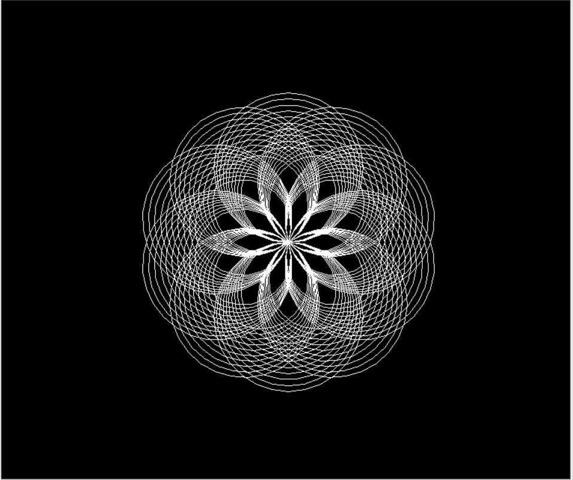

# 나만의 파이썬 프로젝트 제작 
+ `python` 라이브러리 및 프레임워크 사용(`turtle`, `pygame`, `tkinter`)
## 1. 기본적인 코드 모음
['turtle' 기본 코드](https://python.flowdas.com/library/turtle.html)

['pygame' 기본 코드](https://python101.readthedocs.io/pl/latest/_downloads/pygame192.pdf)

['tkinter' 기본 코드](https://www.tutorialspoint.com/python/python_gui_programming.htm)

## 2. 쓸만한 예제로 실습자료 만들기
  - 쓸만한 예제로 실습자료 만들자(turtle)
  
  [`turtle` 실습1](https://trinket.io/python/efc940a414)
  [`turtle` 실습2](https://trinket.io/python/88dd6c94d1)
  [`turtle` 실습3](https://trinket.io/python/64577872dd)
  - 쓸만한 예제로 실습자료 만들자(pygame)
  
  [`pygame` 실습1](http://programarcadegames.com/python_examples/f.php?file=snake.py)
  [`pygame` 실습2](http://programarcadegames.com/python_examples/show_file.php?file=move_sprite_keyboard_smooth.py)
  [`pygame` 실습3](http://programarcadegames.com/python_examples/show_file.php?file=bullets.py)
  - 쓸만한 예제로 실습자료 만들자(tkinter) 
  
  [`tkinter` 실습1](https://www.crocus.co.kr/1520)
  [`tkinter` 실습2](https://www.tutorialsteacher.com/python/create-ui-using-tkinter-in-python)
  [`tkinter` 실습3](https://printed.tistory.com/10)

## 3. 실습 예제들 같이 풀어보기
예제코드들이 각 주제당 3개가 있기 때문에 보고 취향에 맞는 것 골라서 참고하시면 될 것 같습니다. <br>우선 각 주제들의 첫번째 코드들만 같이 해석하도록 하겠습니다. (다 해석하면 날샙니다..)

### 3.1 'turtle' 실습1
 ```python
   import turtle
   import math
   import random

```
우선 여기서는 turtle을 쓰기에 turtle묘듈과 math, random묘듈을 가져옵니다. 
```python
  wn = turtle.Screen()
  wn.bgcolor('black')
  Albert = turtle.Turtle()
  Albert.speed(0)
  Albert.color('white')
  rotate=int(360)
```
turtle 클래스의 Screen을 "wn"이라 지정합니다.<br>(이렇게 하는 이유 : 이렇게 지정한 이후 turtle.Screen()이라고 쓸 것을 wn 한 단어로 쓸 수 있습니다.)<br>
배경색을 검은색으로 지정 후 "Albert"라는 것을 turtle.Turtle로 지정합니다.(위 이유와 마친가지)<br>
Albert를 정지로 해놓고(speed(0)) 색은 흰색으로 지정합니다.
```python
def drawCircles(t,size):
    for i in range(10):
        t.circle(size)
        size=size-4
def drawSpecial(t,size,repeat):
  for i in range (repeat):
    drawCircles(t,size)
    t.right(360/repeat)
drawSpecial(Albert,100,10)

```
"drawCircles"와 "drawSpecial"함수를 만든 후 함수를 실행합니다.<br> 
"drawCircles"함수에서는 원의 크기를 점점 작게 "drawSpecial"함수에서는 "drawCircles"함수가 끝난후 오른쪽으로 얼만큼 회전할지를 지정하여 그립니다.<br>
이후에는 Steve(노란색), Barry(파란색), Terry(주황색), Will(분홍색)을 Albert(하얀색)과 형식을 똑같이 맞춰주면 그림은 완성이 됩니다.<br>



